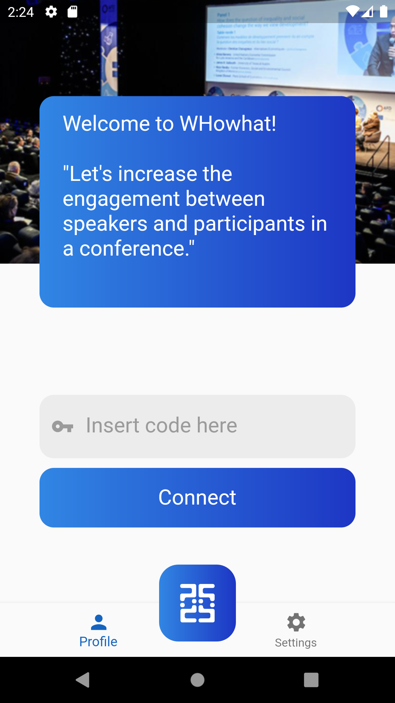

# openCX-its WHoWhat Development Report

Welcome to the documentation pages of the _your (sub)product name_ of **openCX**!

You can find here detailed about the (sub)product, hereby mentioned as module, from a high-level vision to low-level implementation decisions, a kind of Software Development Report (see [template](https://github.com/softeng-feup/open-cx/blob/master/docs/templates/Development-Report.md)), organized by discipline (as of RUP):

- Business modeling
  - [Product Vision](#Product-Vision)
  - [Elevator Pitch](#Elevator-Pitch)
- Requirements
  - [Use Case Diagram](#Use-case-diagram)
  - [User stories](#User-stories)
  - [Domain model](#Domain-model)
- Architecture and Design
  - [Logical architecture](#Logical-architecture)
  - [Physical architecture](#Physical-architecture)
  - [Prototype](#Prototype)
- [Implementation](#Implementation)
- [Test](#Test)
- [Configuration and change management](#Configuration-and-change-management)
- [Project management](#Project-management)

So far, contributions are exclusively made by the initial team, but we hope to open them to the community, in all areas and topics: requirements, technologies, development, experimentation, testing, etc.

Please contact us!

Thank you!

_Emanuel Trigo, Muriel Pinho, Rodrigo Reis, Teresa Corado, Tomás Torres_

---

## Product Vision

Our goal is to increase the engagement between speakers and participants of a remote conference.

---

## Elevator Pitch

Presenters often have a hard time keeping their audience engaged and at the same time guaranteeing they managed to learn the information on the presentation. WHoWhat solves that with an app that provides an easy and engaging way to quiz your audience, with WHoWhat you can spend less time worrying and more time engaging with your audience.

Presenters often have a hard time doing quizzes that are effective and keep their audience engaged. We created WHoWhat, a mobile app that aims to be a simple way to create engaging quizzes and give instant feedback to the presenter and attendees. That way the presenter can interact with the audience identify doubts the ateendees have and which topics he needs to tackle again.

Presenters often have a hard time doing quizzes that are effective and keep their audience engaged. We created WHoWhat, a mobile app, that aims to be a simple way to create engaging quizzes and give instant feedback to the presenter and attendees. That way everyone can identify the points where there is a prominent lack of knowledge.

---

## Requirements

In this section, you should describe all kinds of requirements for your module: functional and non-functional requirements.

Start by contextualizing your module, describing the main concepts, terms, roles, scope and boundaries of the application domain addressed by the project.

### Use case diagram


Create a use-case diagram in UML with all high-level use cases possibly addressed by your module.

Give each use case a concise, results-oriented name. Use cases should reflect the tasks the user needs to be able to accomplish using the system. Include an action verb and a noun.

Briefly describe each use case mentioning the following:

- **Actor**. Name only the actor that will be initiating this use case, i.e. a person or other entity external to the software system being specified who interacts with the system and performs use cases to accomplish tasks.
- **Description**. Provide a brief description of the reason for and outcome of this use case, or a high-level description of the sequence of actions and the outcome of executing the use case.
- **Preconditions and Postconditions**. Include any activities that must take place, or any conditions that must be true, before the use case can be started (preconditions). Describe also the state of the system at the conclusion of the use case execution (postconditions).

- **Normal Flow**. Provide a detailed description of the user actions and system responses that will take place during execution of the use case under normal, expected conditions. This dialog sequence will ultimately lead to accomplishing the goal stated in the use case name and description. This is best done as a numbered list of actions performed by the actor, alternating with responses provided by the system.
- **Alternative Flows and Exceptions**. Document other, legitimate usage scenarios that can take place within this use case, stating any differences in the sequence of steps that take place. In addition, describe any anticipated error conditions that could occur during execution of the use case, and define how the system is to respond to those conditions.

### User stories

User story #1

**As a attendee I want to insert a code in order to join a session**

User interface mockup

    [image]

Acceptance Test:

```gherkin
    Scenario: insert a code that gives access to a session
    Given an existing session code
    When I insert the code
    And I tap the "connect" button
    Then I have access to the session
```

Value and effort

- Value: Must have
- Effort: M


User story #2

**As a speaker I want to create a session**

User interface mockup

    [image]

Acceptance Test:

```gherkin
    Scenario: create a new session
    When I tap the "WHoWhat" button
    Then I have created a session
```

Value and effort

- Value: Must have
- Effort: M


User story #3

**As a user I want to register in the app in order to login afterwards**

User interface mockup




    

Acceptance Test:

```gherkin
Scenario: register in the app
    Given a user that has the app
    When I tap the "register" button
    And I insert my data
    Then my account is created
```

Value and effort

- Value: Must have
- Effort: S

User story #4

**As a user I want to create quizzes in order to create a session**

User interface mockup

    [image]

Acceptance Test:

```gherkin
Scenario: create a quiz
    Given a speaker registered in the app
    When I tap the "add quiz" button
    And insert the questions and respective answers
    Then my quiz is created
```

Value and effort

- Value: Must have
- Effort: M


User story #5

**As a user I want to select one of my quizzes, so I can edit or delete it**

User interface mockup

    [image]

Acceptance Test:

```gherkin
Scenario: select and edit or delete a previously created quiz
    Given a user with a previously created quiz
    When I tap the "my quizzes" button and select my quiz
    And tap "edit" or "delete"
    Then I can edit or delete the data of the quiz selected
```

Value and effort

- Value: Should have
- Effort: L

This section will contain the requirements of the product described as **user stories**, organized in a global **[user story map](https://plan.io/blog/user-story-mapping/)** with **user roles** or **themes**.

For each theme, or role, you may add a small description. User stories should be detailed in the tool you decided to use for project management (e.g. trello or github projects).

A user story is a description of desired functionality told from the perspective of the user or customer. A starting template for the description of a user story is

_As a < user role >, I want < goal > so that < reason >._

**INVEST in good user stories**.
You may add more details after, but the shorter and complete, the better. In order to decide if the user story is good, please follow the [INVEST guidelines](https://xp123.com/articles/invest-in-good-stories-and-smart-tasks/).

**User interface mockups**.
After the user story text, you should add a draft of the corresponding user interfaces, a simple mockup or draft, if applicable.

**Acceptance tests**.
For each user story you should write also the acceptance tests (textually in Gherkin), i.e., a description of scenarios (situations) that will help to confirm that the system satisfies the requirements addressed by the user story.

**Value and effort**.
At the end, it is good to add a rough indication of the value of the user story to the customers (e.g. [MoSCoW](https://en.wikipedia.org/wiki/MoSCoW_method) method) and the team should add an estimation of the effort to implement it, for example, using t-shirt sizes (XS, S, M, L, XL).

### Domain model

To better understand the context of the software system, it is very useful to have a simple UML class diagram with all the key concepts (names, attributes) and relationships involved of the problem domain addressed by your module.

---

## Architecture and Design

The architecture of a software system encompasses the set of key decisions about its overall organization.

A well written architecture document is brief but reduces the amount of time it takes new programmers to a project to understand the code to feel able to make modifications and enhancements.

To document the architecture requires describing the decomposition of the system in their parts (high-level components) and the key behaviors and collaborations between them.

In this section you should start by briefly describing the overall components of the project and their interrelations. You should also describe how you solved typical problems you may have encountered, pointing to well-known architectural and design patterns, if applicable.

### Logical architecture

The purpose of this subsection is to document the high-level logical structure of the code, using a UML diagram with logical packages, without the worry of allocating to components, processes or machines.

It can be beneficial to present the system both in a horizontal or vertical decomposition:

- horizontal decomposition may define layers and implementation concepts, such as the user interface, business logic and concepts;
- vertical decomposition can define a hierarchy of subsystems that cover all layers of implementation.

### Physical architecture


- We chose **Flutter** in order to integrate our app with the `open-cx` main project.
- We chose **Firebase** for database management and backend server, because has a good integration with **Flutter**.

### Prototype

To help on validating all the architectural, design and technological decisions made, we usually implement a vertical prototype, a thin vertical slice of the system.

In this subsection please describe in more detail which, and how, user(s) story(ies) were implemented.

---

## Implementation

Regular product increments are a good practice of product management.

While not necessary, sometimes it might be useful to explain a few aspects of the code that have the greatest potential to confuse software engineers about how it works. Since the code should speak by itself, try to keep this section as short and simple as possible.

Use cross-links to the code repository and only embed real fragments of code when strictly needed, since they tend to become outdated very soon.

---

## Test

There are several ways of documenting testing activities, and quality assurance in general, being the most common: a strategy, a plan, test case specifications, and test checklists.

In this section it is only expected to include the following:

- test plan describing the list of features to be tested and the testing methods and tools;
- test case specifications to verify the functionalities, using unit tests and acceptance tests.

A good practice is to simplify this, avoiding repetitions, and automating the testing actions as much as possible.

---

## Configuration and change management

Configuration and change management are key activities to control change to, and maintain the integrity of, a project’s artifacts (code, models, documents).

For the purpose of ESOF, we will use a very simple approach, just to manage feature requests, bug fixes, and improvements, using GitHub issues and following the [GitHub flow](https://guides.github.com/introduction/flow/).

---

## Project management

Software project management is an art and science of planning and leading software projects, in which software projects are planned, implemented, monitored and controlled.

In the context of ESOF, we expect that each team adopts a project management tool capable of registering tasks, assign tasks to people, add estimations to tasks, monitor tasks progress, and therefore being able to track their projects.

Example of tools to do this are:

- [Trello.com](https://trello.com)
- [Github Projects](https://github.com/features/project-management/com)
- [Pivotal Tracker](https://www.pivotaltracker.com)
- [Jira](https://www.atlassian.com/software/jira)

We recommend to use the simplest tool that can possibly work for the team.

---

## Evolution - contributions to open-cx

Describe your contribution to open-cx (iteration 5), linking to the appropriate pull requests, issues, documentation.

---

## Releases

- [Sprint #1](https://github.com/FEUP-ESOF-2020-21/open-cx-t6g3-its/releases/tag/v0.1)

Releases include the source code and built versions for Android and iOS.
