# openCX-WHoWhat Development Report

Welcome to the documentation pages of the _WHoWhat_ of **openCX**!

You can find here detailed about the WHoWhat, hereby mentioned as module, from a high-level vision to low-level implementation decisions, a kind of Software Development Report (see [template](https://github.com/softeng-feup/open-cx/blob/master/docs/templates/Development-Report.md)), organized by discipline (as of RUP):

- Business modeling
  - [Product Vision](#Product-Vision)
  - [Elevator Pitch](#Elevator-Pitch)
- Requirements
  - [Use Case Diagram](#Use-case-diagram)
  - [User stories](#User-stories)
  - [Domain model](#Domain-model)
- Architecture and Design
  - [Logical architecture](#Logical-architecture)
  - [Physical architecture](#Physical-architecture)
  - [Prototype](#Prototype)
- [Implementation](#Implementation)
- [Test](#Test)
- [Configuration and change management](#Configuration-and-change-management)
- [Project management](#Project-management)

So far, contributions are exclusively made by the initial team, but we hope to open them to the community, in all areas and topics: requirements, technologies, development, experimentation, testing, etc.

Please contact us!

Thank you!

_Emanuel Trigo, Muriel Pinho, Rodrigo Reis, Teresa Corado_

---

## Product Vision

Polling perspectives on a matter, creating a more captivating experience of a remote conference.

---

## Elevator Pitch

Presenters sometimes have a difficult time getting the attendees perspectives in a conference while keeping the audience engaged. WHoWhat solves that with an app that provides an easy and engaging way to poll audiences anywhere, in real-time.

---

## Requirements

In this section, we describe all kinds of requirements for our module: functional and non-functional requirements.

### Use case diagram

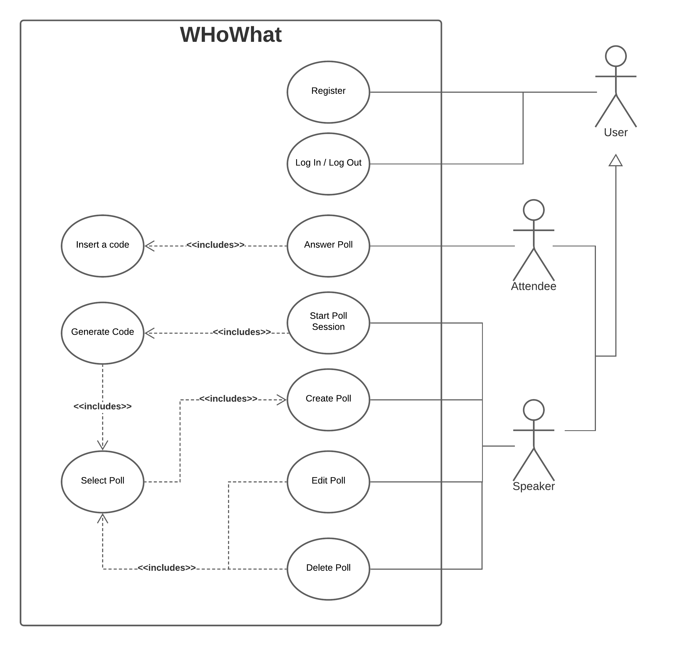

- **Actor**. Name only the actor that will be initiating this use case, i.e. a person or other entity external to the software system being specified who interacts with the system and performs use cases to accomplish tasks.
- **Description**. Provide a brief description of the reason for and outcome of this use case, or a high-level description of the sequence of actions and the outcome of executing the use case.
- **Preconditions and Postconditions**. Include any activities that must take place, or any conditions that must be true, before the use case can be started (preconditions). Describe also the state of the system at the conclusion of the use case execution (postconditions).

- **Normal Flow**. Provide a detailed description of the user actions and system responses that will take place during execution of the use case under normal, expected conditions. This dialog sequence will ultimately lead to accomplishing the goal stated in the use case name and description. This is best done as a numbered list of actions performed by the actor, alternating with responses provided by the system.
- **Alternative Flows and Exceptions**. Document other, legitimate usage scenarios that can take place within this use case, stating any differences in the sequence of steps that take place. In addition, describe any anticipated error conditions that could occur during execution of the use case, and define how the system is to respond to those conditions.

##### Answer Poll

- **Actor**. Atendee

- **Description**. 

- **Preconditions and Postconditions**. 

- **Normal Flow**.

- **Alternative Flows and Exceptions**.

##### Start Poll Session

- **Actor**. Speaker

- **Description**. This use case exists in order to 

- **Preconditions and Postconditions**. 

- **Normal Flow**.

- **Alternative Flows and Exceptions**.

##### Create Poll

- **Actor**. Speaker

- **Description**. This use case exists so that the speaker can create new polls.

- **Preconditions and Postconditions**. The user must have a valid account. After the creating the poll will be added to the account polls.

- **Normal Flow**.
    1. The speaker chooses to create a new poll.
    2. A new poll screen will be prompt.
    3. The speaker type the poll information.
    4. The speaker chooses to add questions.
    5. The speaker type the question and options.
    6. The new poll is added to the database and the speaker account

- **Alternative Flows and Exceptions**.
    1. The speaker chooses to create a new poll.
    2. A new poll screen will be prompt.
    3. The speaker invalid information.
    4. An error message will appear.


##### Edit Poll

- **Actor**. Speaker

- **Description**. This use case exists so that the speaker can change at any time his polls attributes .

- **Preconditions and Postconditions**. The speaker must have a valid poll selected . After being submitted the poll information is updated in the database.

- **Normal Flow**.
    1. The speaker selects a valid poll.
    2. A new screen will open with the poll information.
    3. The speaker changes the poll information and submits.
    4. All the poll attributes will be updated on the database.

- **Alternative Flows and Exceptions**.
    1. The speaker selects a valid poll.
    2. A new screen will open with the poll information.
    3. The speaker changes the poll information.
    4. The new information is invalid.
    5. An error message will appear warning the speaker to redo the changes.


##### Delete Poll

- **Actor**. Speaker

- **Description**.  This use case exists so that the speaker can delete his previous created polls.

- **Preconditions and Postconditions**. The speaker must select a valid poll.

- **Normal Flow**.
    1. The speaker select a valid poll.
    2. The speaker chooses to delete the selected poll.
    3. The poll will be deleted in the database.

- **Alternative Flows and Exceptions**.


##### Register

- **Actor**. User

- **Description**. this use case exists so that the user is able to create a personal account in order save their data such as the polls they will use in upcoming conferences.

- **Preconditions and Postconditions**. in order to register in the app the user must insert their respective data, such as their personal email and a password.

- **Normal Flow**.
    1. The user selects the register option.
    2. The user inserts their personal email and password.
    3. The user selects the submitting button.
    4. A new account is created with the data of the user.
    5. The screen is redirrected to the home page of the app with the user's new account logged in.

- **Alternative Flows and Exceptions**.

##### Log in with google

- **Actor**. User

- **Description**. this use case exists so that the user is able to enter in their personal account associated with their already existing google account in order save their data such as the polls they will use in upcoming conferences.

- **Preconditions and Postconditions**. in order to register in the app via google the user must have a personal google account.

- **Normal Flow**.
    1. The user selects the 'Log in with google' option.
    2. The user logs in their google account.
    3. The user selects the submitting button.
    4. The screen is redirrected to the home page of the app with the user's account logged in.

- **Alternative Flows and Exceptions**.

##### Log in

- **Actor**. User

- **Description**. 

- **Preconditions and Postconditions**. in order to log in on the app the user must have previously registered in it and insert the same credentials. 

- **Normal Flow**.
    1. The user inserts the email and password associated with their account.
    2. The user selects the log in button.
    3. The screen is redirrected to the home page with the user's logged in account.

- **Alternative Flows and Exceptions**.
    1. The user inserts an incorrect email or password associated with their personal account.
    2. The user selects the log in button.
    3. An error message appears, stating that one of the fields was typed incorrectly.
    4. The user inserts the correct data associated with their account.
    5. The user selects the log in button.
    6. The screen is redirrected to the home page with the user's logged in account.


##### Log out

- **Actor**. User

- **Description**. 

- **Preconditions and Postconditions**. In order to log out from the app, the user must be already logged in. 

- **Normal Flow**.
    
- **Alternative Flows and Exceptions**.


### User stories

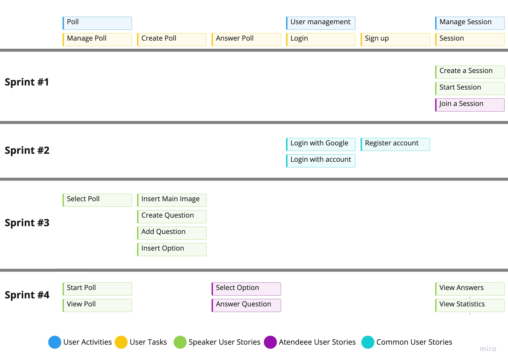

User story #1

**As a attendee I want to insert a code in order to join a session**

User interface mockup

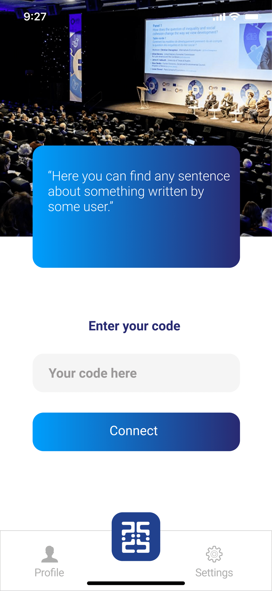

Acceptance Test:

```gherkin
    Scenario: insert a code that gives access to a session
    Given an existing session code
    When I insert the code
    And I tap the "connect" button
    Then I have joined the session
```

Value and effort

- Value: Must have
- Effort: M


User story #2

**As a speaker I want to start a poll**

User interface mockup

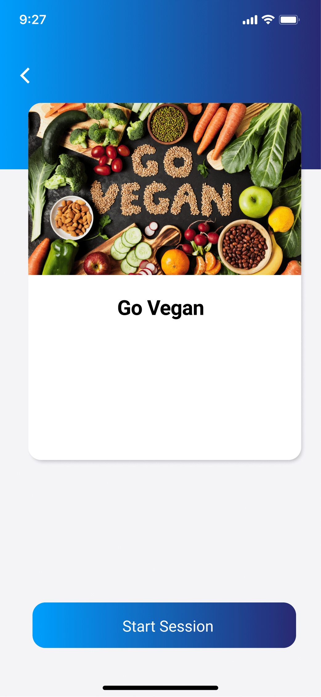

Acceptance Test:

```gherkin
    Scenario: start a poll
    When I tap the "WHoWhat" button and select my poll
    And tap the Start Session button
    Then I have started a session
```

Value and effort

- Value: Must have
- Effort: M


User story #3

**As a user I want to register in the app**

User interface mockup

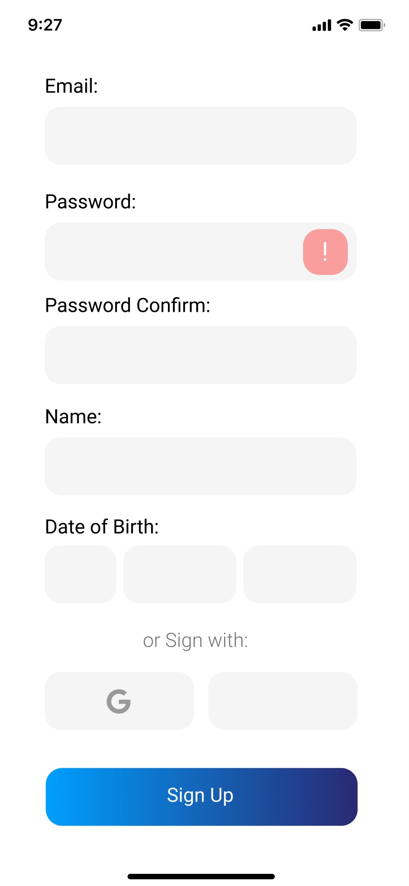


Acceptance Test:

```gherkin
Scenario: register in the app
    Given a user that has the app
    When I tap the "Sign Up" button
    And I insert my data
    Then my account is created
```

Value and effort

- Value: Must have
- Effort: S

User story #4

**As a speaker I want to create a poll**

User interface mockup


Acceptance Test:

```gherkin
Scenario: create a poll
    Given a speaker registered in the app
    When I tap the "add poll" button and insert name and description
    And I tap create and continue
    Then my poll is created
```

Value and effort

- Value: Must have
- Effort: M


User story #5

**As a user I want to manage my polls**

User interface mockup


Acceptance Test:

```gherkin
Scenario: edit or delete a previously created poll
    Given a user with previously created polls
    When I tap the "profile" button and select my poll
    And tap the "poll card"
    Then I can edit or delete the data of the poll
```

Value and effort

- Value: Should have
- Effort: L

User story #6

**As a user I want to login with my account**

User interface mockup

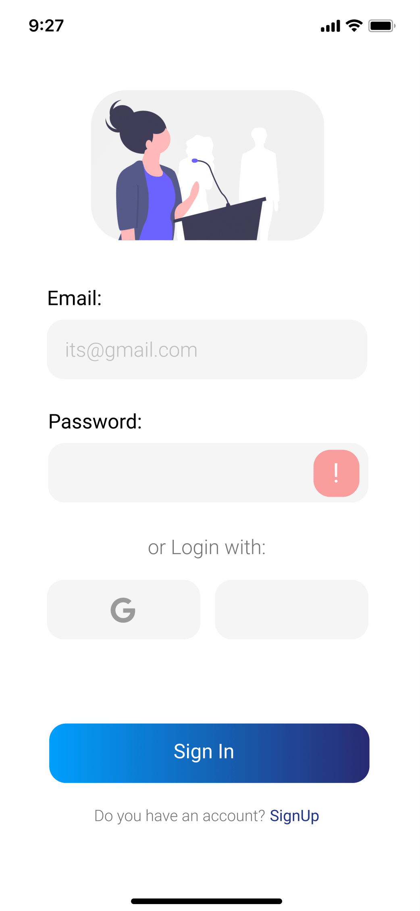


Acceptance Test:

```gherkin
Scenario: login in the app
    Given a user that has an created account
    When I insert my data
    And I tap the "Sign In" button
    Then my account is used to sign in
```

Value and effort

- Value: Must have
- Effort: M

User story #7

**As a speaker i want to insert the options to a question**

User interface mockup

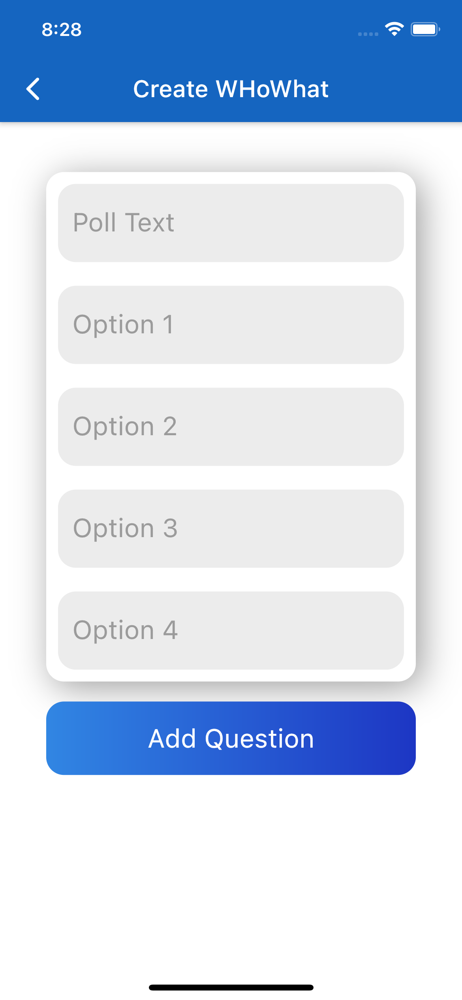


Acceptance Test:

```gherkin
Scenario: add options to question
    Given a speaker that has a created poll
    When I create a "question"
    And I fill the options 
    Then options are added to the question
```

Value and effort

- Value: Must have
- Effort: L

User story #8

**As a speaker i want to add and image representing my poll**

User interface mockup


Acceptance Test:

```gherkin
Scenario: add image to poll
    Given a speaker registered in the app
    When I tap the "add poll" button and click on the image
    And select and image from the gallery
    Then my image is added to my poll
```

Value and effort

- Value: Must have
- Effort: M

User story #9

**As a speaker i want to create the questions of a poll**

User interface mockup

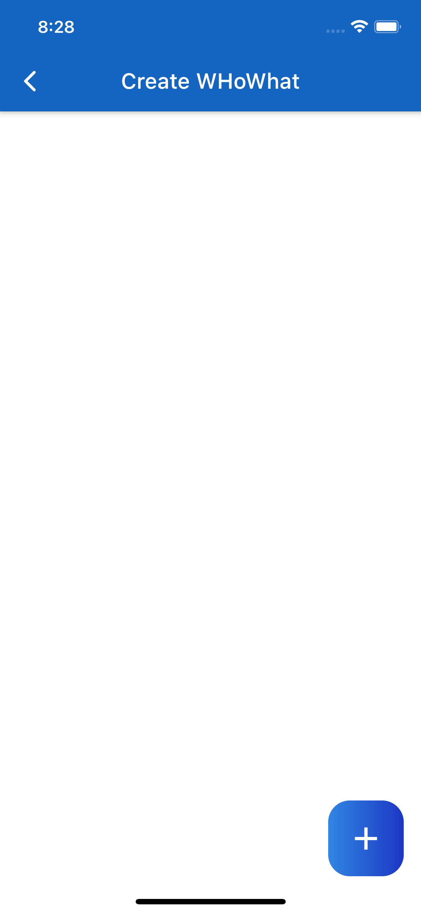


Acceptance Test:

```gherkin
Scenario: add question to poll
    Given a speaker that has an created poll
    When I select a created "poll" and 
    And press the "+" button
    Then a question is added to poll
```

Value and effort

- Value: Must have
- Effort: M

User story #10

**As a user I want to login with google**

User interface mockup


Acceptance Test:

```gherkin
Scenario: login with google
    Given a user that has an google account
    When I Tap the "google" icon
    And I insert my data
    Then my google account is used to sign in
```

Value and effort

- Value: Should have
- Effort: S

User story #11

**As a user I want to select a polls**

User interface mockup


Acceptance Test:

```gherkin
Scenario: select a previously created poll
    Given a user with a previously created poll
    When I tap the "WHoWhat" button 
    And select my poll
    Then i can start a session or edit the poll
```

Value and effort

- Value: must have
- Effort: M

User story #12

**As a atendee I want to answer the question on a poll**

User interface mockup

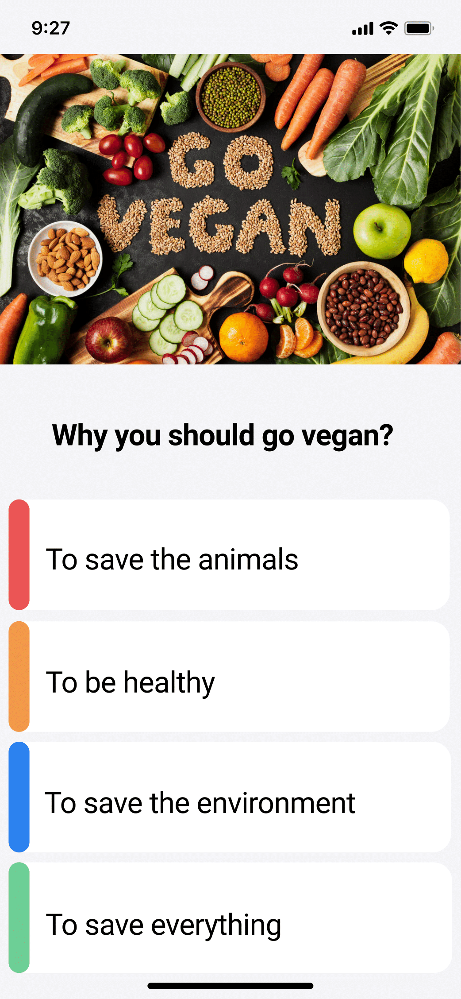

Acceptance Test:

```gherkin
Scenario: answer question in poll
    Given a user who joined a session
    When the session starts and the "questions" appear 
    Then i can select an option to answer the question
```

Value and effort

- Value: must have
- Effort: L


User story #13

**As a user I want to select my polls**

User interface mockup


Acceptance Test:

```gherkin
Scenario: select my previously created polls
    Given a user with previously created polls
    When I tap the "WHoWhat" button 
    Then i have acess to my polls
```

Value and effort

- Value: must have
- Effort: M


### Domain model

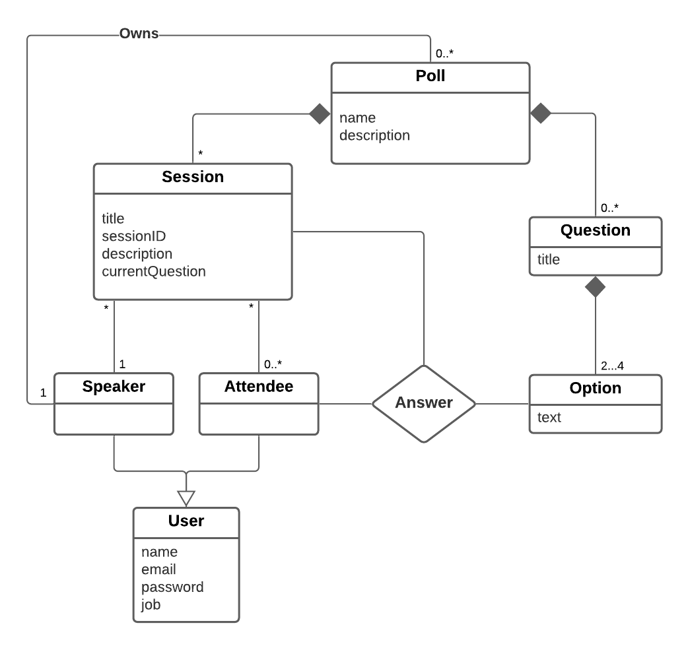

Our domain consists of two main classes Session and Poll and a Ternary relation called Answer.
- Poll is composed of Question and Session, having Zero or more Sessions and 1 or more Questions which in turn are composed of between 2 and 4 Options. 
- Poll has one Speaker but a Speaker can have multiple Polls.
- Speaker and Atendee are generalizations of User.
- Session has exactly one Speaker and 0 or more Atendees
- Answer is a ternary relation between Session, Atendeee and Option, as an answer depends on those three to be created. 


---

## Architecture and Design

The architecture of a software system encompasses the set of key decisions about its overall organization.

We will be talking about the logical architecture, a high-level view of the code structure, and the physical architecture, which will show the connection between each machine and the used technologies.

### Logical architecture

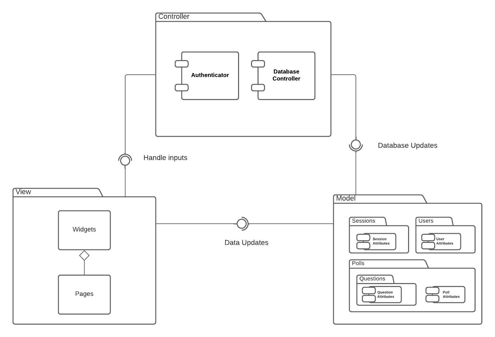

We choose the MVC approach because it fits perfectly the project structure and it's simple.

The Model contains the main packages of data: Sessions, Polls, Users, Questions. The View is composed of Widgets and Pages that are responsible of displaying the information.

The Controller responsability is to query the database using Model (Authenticator and Database Controller) and retrieve the information to the View, in order to display it.

### Physical architecture

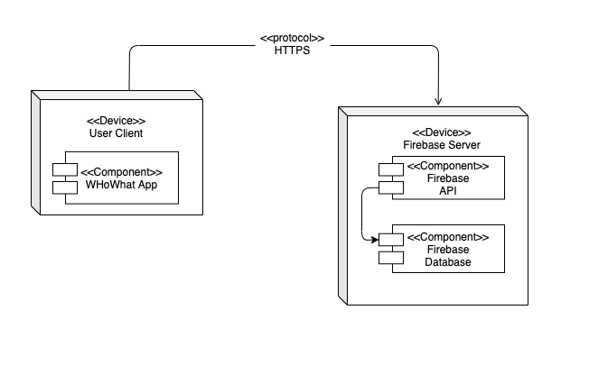
<br>


- We chose **Flutter** in order to integrate our app with the `open-cx` main project.
- We chose **Firebase** for database management and backend server, because has a good integration with **Flutter**.
- Our project's physical architecture is simple, the user installs the **WHoWhat** app on his smartphone, serving as his client, and the app communicates with the firebase server via HTTPS requests, where our database is stored, the server handles the communication of the API with the Database, storing and retrieving all information needed for **WHoWhat**.

### Prototype

To design our project's UI we used **Figma**, which enabled us to create screen mockups, plan an usage flow to the app and link them together to create a usable prototype. Here's a GIF from the result:


---

## Implementation

The implementation was divided in iterations, here are the releases for each of them:

- [Iteration #1 - v0.1](https://github.com/FEUP-ESOF-2020-21/open-cx-t6g3-its/releases/tag/v0.1)
- [Iteration #2 - v0.2](https://github.com/FEUP-ESOF-2020-21/open-cx-t6g3-its/releases/tag/v0.2)
- [Iteration #3 - v0.3](https://github.com/FEUP-ESOF-2020-21/open-cx-t6g3-its/releases/tag/v0.3)

Releases include the source code and built versions for Android and iOS.

---

## Test

There are several ways of documenting testing activities, and quality assurance in general, being the most common: a strategy, a plan, test case specifications, and test checklists.

In this section it is only expected to include the following:

- test plan describing the list of features to be tested and the testing methods and tools;
- test case specifications to verify the functionalities, using unit tests and acceptance tests.

A good practice is to simplify this, avoiding repetitions, and automating the testing actions as much as possible.

---

## Configuration and change management

Configuration and change management are key activities to control change to, and maintain the integrity of, a project’s artifacts (code, models, documents).

For the purpose of ESOF, we used a very simple approach, just to manage feature requests, bug fixes, and improvements, using GitHub issues and following the [GitHub flow](https://guides.github.com/introduction/flow/).

---

## Project management

To plan and manage our product development we used **Github Projects**:
[WHoWhat Project Board](https://github.com/FEUP-ESOF-2020-21/open-cx-t6g3-its/projects/1)


---

## Evolution - contributions to open-cx

Describe your contribution to open-cx (iteration 5), linking to the appropriate pull requests, issues, documentation.


