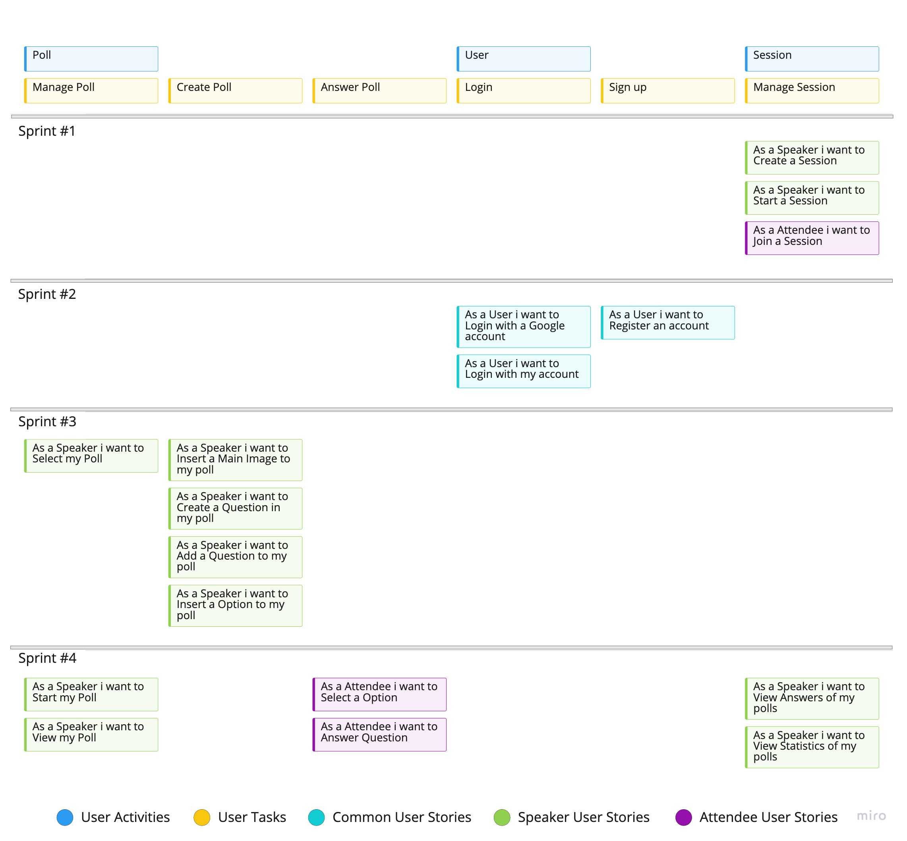
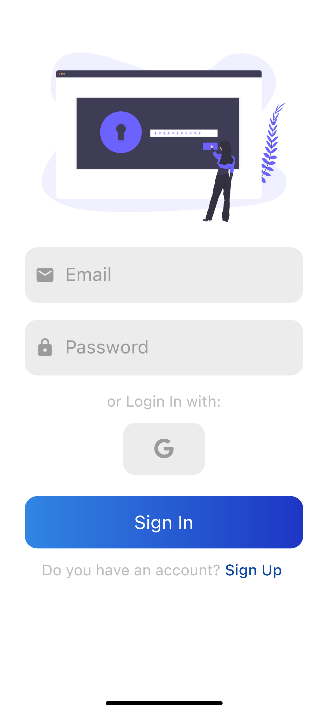
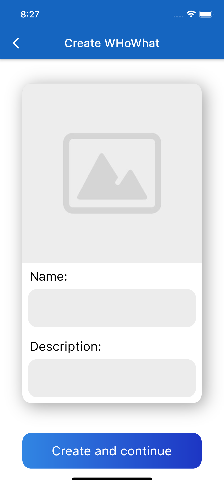

# openCX-WHoWhat Development Report

Welcome to the documentation pages of the _WHoWhat_ of **openCX**!

You can find here detailed about the WHoWhat, hereby mentioned as module, from a high-level vision to low-level implementation decisions, a kind of Software Development Report (see [template](https://github.com/softeng-feup/open-cx/blob/master/docs/templates/Development-Report.md)), organized by discipline (as of RUP):

- Business modeling
  - [Product Vision](#Product-Vision)
  - [Elevator Pitch](#Elevator-Pitch)
- Requirements
  - [Use Case Diagram](#Use-case-diagram)
  - [User stories](#User-stories)
  - [Domain model](#Domain-model)
- Architecture and Design
  - [Logical architecture](#Logical-architecture)
  - [Physical architecture](#Physical-architecture)
  - [Prototype](#Prototype)
- [Implementation](#Implementation)
- [Test](#Test)
- [Configuration and change management](#Configuration-and-change-management)
- [Project management](#Project-management)

So far, contributions are exclusively made by the initial team, but we hope to open them to the community, in all areas and topics: requirements, technologies, development, experimentation, testing, etc.

Please contact us!

Thank you!

_Emanuel Trigo, Muriel Pinho, Rodrigo Reis, Teresa Corado, Tomás Torres_

---

## Product Vision

Increase the engagement between speakers and attendees perspectives on a matter, creating a more captivating experience of a remote conference.

---

## Elevator Pitch

Presenters sometimes have a difficult time getting the attendees perspectives in a conference while keeping the audience engaged. WHoWhat solves that with an app that provides an easy and engaging way to poll your audience anywhere, in real-time.

---

## Requirements

In this section, you should describe all kinds of requirements for your module: functional and non-functional requirements.

Start by contextualizing your module, describing the main concepts, terms, roles, scope and boundaries of the application domain addressed by the project.

### Use case diagram


- **Actor**. Name only the actor that will be initiating this use case, i.e. a person or other entity external to the software system being specified who interacts with the system and performs use cases to accomplish tasks.
- **Description**. Provide a brief description of the reason for and outcome of this use case, or a high-level description of the sequence of actions and the outcome of executing the use case.
- **Preconditions and Postconditions**. Include any activities that must take place, or any conditions that must be true, before the use case can be started (preconditions). Describe also the state of the system at the conclusion of the use case execution (postconditions).

- **Normal Flow**. Provide a detailed description of the user actions and system responses that will take place during execution of the use case under normal, expected conditions. This dialog sequence will ultimately lead to accomplishing the goal stated in the use case name and description. This is best done as a numbered list of actions performed by the actor, alternating with responses provided by the system.
- **Alternative Flows and Exceptions**. Document other, legitimate usage scenarios that can take place within this use case, stating any differences in the sequence of steps that take place. In addition, describe any anticipated error conditions that could occur during execution of the use case, and define how the system is to respond to those conditions.

### User stories


User story #1

**As a attendee I want to insert a code in order to join a session**

User interface mockup


Acceptance Test:

```gherkin
    Scenario: insert a code that gives access to a session
    Given an existing session code
    When I insert the code
    And I tap the "connect" button
    Then I have access to the session
```

Value and effort

- Value: Must have
- Effort: M


User story #2

**As a speaker I want to create a session**

User interface mockup


Acceptance Test:

```gherkin
    Scenario: create a new session
    When I tap the "WHoWhat" button
    Then I have created a session
```

Value and effort

- Value: Must have
- Effort: M


User story #3

**As a user I want to register in the app in order to login afterwards**

User interface mockup




<br>


Acceptance Test:

```gherkin
Scenario: register in the app
    Given a user that has the app
    When I tap the "register" button
    And I insert my data
    Then my account is created
```

Value and effort

- Value: Must have
- Effort: S

User story #4

**As a user I want to create polls in order to create a session**

User interface mockup



Acceptance Test:

```gherkin
Scenario: create a poll
    Given a speaker registered in the app
    When I tap the "add poll" button
    And insert the questions and respective answers
    Then my poll is created
```

Value and effort

- Value: Must have
- Effort: M


User story #5

**As a user I want to select one of my polls, so I can edit or delete it**

User interface mockup


Acceptance Test:

```gherkin
Scenario: select and edit or delete a previously created poll
    Given a user with a previously created poll
    When I tap the "my polls" button and select my poll
    And tap "edit" or "delete"
    Then I can edit or delete the data of the poll selected
```

Value and effort

- Value: Should have
- Effort: L

### Domain model


Our domain consists of two main classes Session and Poll and a Ternary relation called Answer.
- Poll is composed of Question and Session, having Zero or more Sessions and 1 or more Questions which in turn are composed of between 2 and 4 Options. 
- Poll has one Speaker but a Speaker can have multiple Polls.
- Speaker and Atendee are generalizations of User.
- Session has exactly one Speaker and 0 or more Atendees
- Answer is a ternary relation between Session, Atendeee and Option, as an answer depends on those three to be created. 


---

## Architecture and Design

The architecture of a software system encompasses the set of key decisions about its overall organization.

We will be talking about the logical architecture, a high-level view of the code structure, and the physical architecture, which will show the connection between each machine and the used technologies.

### Logical architecture

The purpose of this subsection is to document the high-level logical structure of the code, using a UML diagram with logical packages, without the worry of allocating to components, processes or machines.

It can be beneficial to present the system both in a horizontal or vertical decomposition:

- horizontal decomposition may define layers and implementation concepts, such as the user interface, business logic and concepts;
- vertical decomposition can define a hierarchy of subsystems that cover all layers of implementation.

### Physical architecture


<br>


- We chose **Flutter** in order to integrate our app with the `open-cx` main project.
- We chose **Firebase** for database management and backend server, because has a good integration with **Flutter**.
- Our project's physical architecture is simple, the user installs the **WHoWhat** app on his smartphone, serving as his client, and the app communicates with the firebase server via HTTPS requests, where our database is stored, the server handles the communication of the API with the Database, storing and retrieving all information needed for **WHoWhat**.

### Prototype

To design our project's UI we used **Figma**, which enabled us to create screen mockups, plan an usage flow to the app and link them together to create a usable prototype. Here's a GIF from the result:


#### Include an export from figma 

---

## Implementation

The implementation was divided in iterations, here are the releases for each of them:

- [Iteration #1 - v0.1](https://github.com/FEUP-ESOF-2020-21/open-cx-t6g3-its/releases/tag/v0.1)
- [Iteration #2 - v0.2](https://github.com/FEUP-ESOF-2020-21/open-cx-t6g3-its/releases/tag/v0.2)
- [Iteration #3 - v0.3](https://github.com/FEUP-ESOF-2020-21/open-cx-t6g3-its/releases/tag/v0.3)

Releases include the source code and built versions for Android and iOS.

---

## Test

There are several ways of documenting testing activities, and quality assurance in general, being the most common: a strategy, a plan, test case specifications, and test checklists.

In this section it is only expected to include the following:

- test plan describing the list of features to be tested and the testing methods and tools;
- test case specifications to verify the functionalities, using unit tests and acceptance tests.

A good practice is to simplify this, avoiding repetitions, and automating the testing actions as much as possible.

---

## Configuration and change management

Configuration and change management are key activities to control change to, and maintain the integrity of, a project’s artifacts (code, models, documents).

For the purpose of ESOF, we used a very simple approach, just to manage feature requests, bug fixes, and improvements, using GitHub issues and following the [GitHub flow](https://guides.github.com/introduction/flow/).

---

## Project management

To plan and manage our product development we used **Github Projects**:
[WHoWhat Project Board](https://github.com/FEUP-ESOF-2020-21/open-cx-t6g3-its/projects/1)


---

## Evolution - contributions to open-cx

Describe your contribution to open-cx (iteration 5), linking to the appropriate pull requests, issues, documentation.


